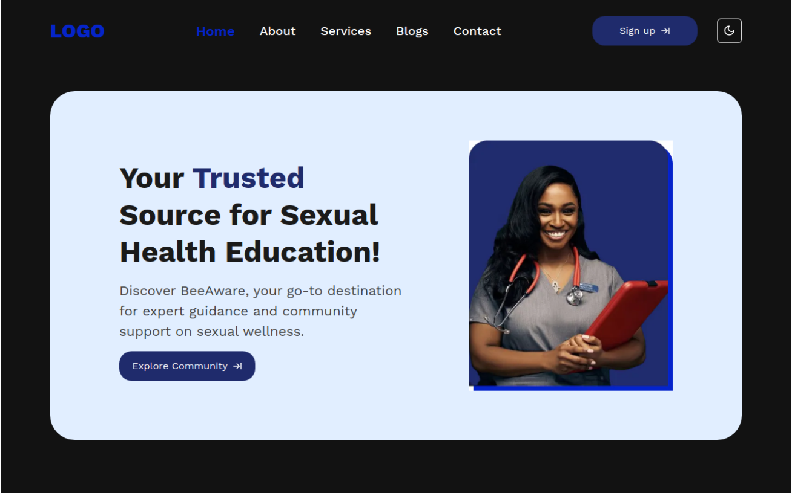

# BeeAware

Welcome to the BeeAware Frontend codebase!

This is an application designed for individuals with little or no knowledge of Sexually Transmitted Infections/Diseases, individuals diagnosed with STIs, family members and caregivers of individuals with STIs, and healthcare professionals working with STIs patients.

This repository contains the source code for the BeeAware Frontend Application. It is implemented in Next with TypeScript and styled with Tailwind CSS.

## Dependencies

The following dependencies were used to build the application:

- **NextJS** - This is a React framework for building full-stack web applications. You use React Components to build user interfaces, and Next.js for additional features and optimizations.

You install using

```bash
npx create-next-app@latest
```

- **shadCN** - This is a collection of reusable components that you can copy and paste into your apps. It uses Tailwind CSS to style the components. Also comes with lucid-react, clsx and class-variance-authority (CVA).

You install using

```bash
npx shadcn-ui@latest init
```

You will be asked a few questions to configure components.json:

```bash
Which style would you like to use? › Default
Which color would you like to use as base color? › Slate
Do you want to use CSS variables for colors? › no / yes

```

## DevDependencies

The following development dependencies were used to build the application:

- **Typescript** - This is JavaScript with syntax for types. TypeScript is a strongly typed programming language that builds on JavaScript, giving you better tooling at any scale.

You install using

```bash
npm install typescript --save-dev
npx tsc
```

- **TailwindCSS** - This is a utility-first CSS framework packed with classes like flex, pt-4, text-center and rotate-90 that can be composed to build any design, directly in your markup.

You install using

```bash
npm install -D tailwindcss postcss autoprefixer
npx tailwindcss init -p
```


## BeeAware Application

- This is the link to the deployed application. 

[BeeAware App](https://bee-aware.vercel.app/)

## Screenshot



## Project Status

This app is currently developed and maintained by the Tech4Dev Group 90 Frontend Team. At this time, we do not accept external contributions or pull requests. The project is primarily for personal use or demonstration purposes.

## Credits

The Loan Prediction App codebase is being developed by the following individuals:

- [Perpetual Meninwa](https://github.com/Perpy-del)
- [Perpetual Obu-Amu](https://github.com/Perpetual25)
